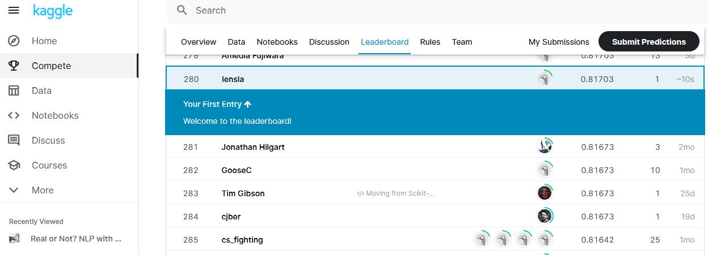

## Project Name
Predict which tweets are about real dissters and which ones are not in a couple lines of code.
Data for calculation taken from https://www.kaggle.com/c/nlp-getting-started

### General info
If you need to get quickly some initial results in typical NLP task 
than using packes [Flair](https://github.com/flairNLP/flair), [Texthero](https://texthero.org/) and [DistilBERT](https://huggingface.co/transformers/model_doc/distilbert.html) would give quite good results.

### Libraries and useful links

1. [Flair Embeddings](https://github.com/flairNLP/flair/blob/master/resources/docs/embeddings/FLAIR_EMBEDDINGS.md)
2. [FastText Embeddings](https://github.com/flairNLP/flair/blob/master/resources/docs/embeddings/FASTTEXT_EMBEDDINGS.md)
3. [TransformerWordEmbeddings](https://github.com/flairNLP/flair/blob/master/resources/docs/embeddings/TRANSFORMER_EMBEDDINGS.md)
4. [How to use flair with keras](https://lekonard.github.io/blog/how-to-use-flair-with-keras/)

## Status
Project is: _in progress_, 

### Inspiration

 Project inspired by
 [Kaggle nootebook](https://www.kaggle.com/vbmokin/nlp-eda-bag-of-words-tf-idf-glove-bert)

##### _result on leaderboard_ 

### Info
Created by [@len-sla]

